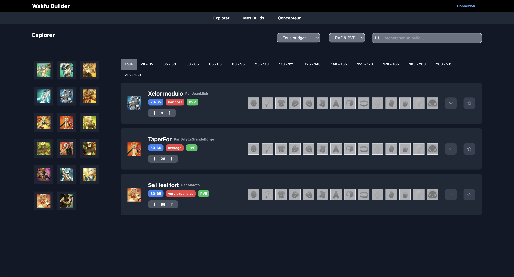
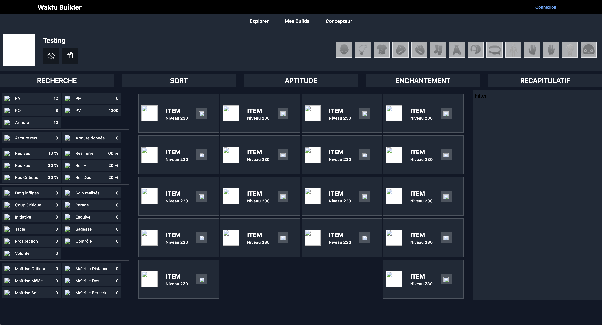

# ⚔️ Wakfu Builder

**Wakfu Builder** is an work-in-progress web app designed to help players of the tactical MMORPG **Wakfu** configure and visualize their items, sets, and builds.

This project is currently a draft and includes:

- 🛠️ A conceptor to experiment with builds
- 🏠 A default landing page
- 🧱 A foundation for future modules (stats preview, set bonuses, export, etc.)

---

## 📦 Tech Stack

- **Frontend:** React + TypeScript
- **Styling:** Tailwind CSS
- **State Management:** (TBD)
- **Backend:** (Planned)
- **Game Data:** (Custom structure or scraped API - WIP)

---

## 🚀 Getting Started

```bash
git clone https://github.com/ouakeds/wakfu-builder.git
cd wakfu-builder
npm install
npm run dev
```

Open [http://localhost:5173](http://localhost:5173) to view the app in development mode.

---

## 📸 Screenshots 







---

## 📅 Roadmap (Draft)

- [x] Landing page structure
- [x] Conceptor base UI
- [ ] Item and set input structure
- [ ] Stats calculator & display
- [ ] Preset sharing/export
- [ ] Mobile-friendly layout
- [ ] Authentication (optional)

---

## 🙋‍♂️ Contribution

This is a personal side project, but feel free to open issues or suggest improvements. Contributions are welcome once a stable base is in place.

---

## ✨ Author

Made with passion by [Sabri Ouaked](https://www.linkedin.com/in/sabri-ouaked/)

[](https://github.com/ouakeds)

---

## 📄 License

MIT License – free to use and modify.
